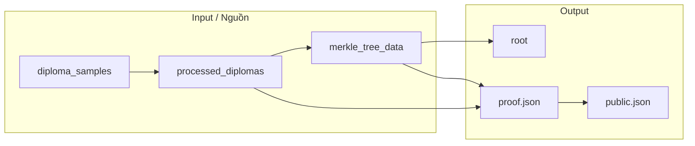

# Sơ đồ tổng quan — Chứng minh văn bằng (ZK)

---

## 1. Tạo Merkle root ban đầu

```
┌─────────────────────┐
│ diploma_samples.json │
│ (raw văn bằng)       │
└──────────┬──────────┘
           │  prepare_diploma_data.js
           │  • nameHash = Poseidon(name chunks)
           │  • leafHash = Poseidon(nameHash, majorCode, studentId, issueDate)
           ▼
┌─────────────────────┐
│processed_diplomas   │
│.json (có leafHash)  │
└──────────┬──────────┘
           │  create_merkle_tree_depth.js
           │  • leaves = [leafHash...] + pad "0" đến 2^depth
           │  • hashPair(left,right) = Poseidon(left, right)
           │  • Build cây từ dưới lên
           ▼
┌─────────────────────┐     ┌──────────────────────────────────┐
│ merkle_tree_data_   │     │         CÂY MERKLE                 │
│ depth_X.json        │     │                                    │
│                     │     │           [ROOT]                    │
│ • root              │ ◄── │          /      \                  │
│ • depth             │     │        H01        H23               │
│ • proofs[]          │     │       /  \       /  \               │
└─────────────────────┘     │     L0   L1    L2   L3   (leaves)  │
                            └──────────────────────────────────┘
```

---

## 2. Luồng tạo proof (off-chain)

```
┌──────────────┐    generate_input_depth.js     ┌──────────────┐
│ processed_   │    (diploma + root +           │ input_       │
│ diplomas +   │     pathIndices + siblings)   │ depth_X_     │
│ merkle_data  │ ───────────────────────────►  │ index_Y.json │
└──────────────┘                               └──────┬───────┘
                                                       │
                                                       │ generate_witness.js
                                                       │ (WASM)
                                                       ▼
┌──────────────┐    snarkjs groth16 prove      ┌──────────────┐
│ proof.json   │ ◄─────────────────────────────│ witness.wtns  │
│ public.json  │    (zkey + witness)            │              │
└──────────────┘                               └──────────────┘
```

---

## 3. Kiểm tra proof trên chain

```
     USER                                    CHAIN
       │                                        │
       │  verifyDiploma(a, b, c, [root])        │
       │ ─────────────────────────────────────►│
       │                                        │
       │                            ┌───────────▼───────────┐
       │                            │   DiplomaManager      │
       │                            │   • validRoots[root]? │
       │                            │   • verifier.verify() │
       │                            └───────────┬───────────┘
       │                                        │
       │                            ┌───────────▼───────────┐
       │                            │   Groth16Verifier      │
       │                            │   • pairing check       │
       │                            │   • return true/false  │
       │                            └───────────┬───────────┘
       │                                        │
       │  tx success / revert                    │
       │ ◄──────────────────────────────────────│
```

---

## 4. Toàn bộ luồng từ đầu đến cuối (Mermaid)

```mermaid
flowchart TB
    subgraph Setup
        A[diploma_samples.json] --> B[prepare_diploma_data]
        B --> C[processed_diplomas.json]
        C --> D[create_merkle_tree_depth]
        D --> E[merkle_tree_data: root + proofs]
        F[Deploy Verifier + Manager] --> G[addRoot(root)]
        E --> G
    end

    subgraph Prove["Prove (off-chain)"]
        C --> H[generate_input]
        E --> H
        H --> I[input.json]
        I --> J[generate_witness]
        J --> K[witness.wtns]
        K --> L[snarkjs groth16 prove]
        L --> M[proof.json + public.json]
    end

    subgraph Verify["Verify (on-chain)"]
        M --> N[verifyDiploma(a,b,c,root)]
        N --> O[validRoots[root]?]
        O --> P[verifier.verifyProof]
        P --> Q[Pairing check]
        Q --> R[DiplomaVerified / Revert]
    end
```

---

## 5. Sơ đồ đơn giản 3 luồng

```
┌─────────────────────────────────────────────────────────────────────────────┐
│  LUỒNG 1: TẠO ROOT                                                          │
│  diploma_samples → prepare_diploma_data → processed_diplomas                 │
│  processed_diplomas → create_merkle_tree_depth → root + proofs             │
├─────────────────────────────────────────────────────────────────────────────┤
│  LUỒNG 2: TẠO PROOF                                                         │
│  input.json → witness.wtns → proof.json + public.json                        │
├─────────────────────────────────────────────────────────────────────────────┤
│  LUỒNG 3: VERIFY ON-CHAIN                                                   │
│  addRoot(root) → [sau đó] verifyDiploma(proof, root) → validRoots? + pairing│
└─────────────────────────────────────────────────────────────────────────────┘
```

---

## 6. Dữ liệu vào/ra chính



File này nằm tại **docs/overview-diagrams.md**. Bạn có thể mở trong editor hỗ trợ Mermaid (hoặc GitHub) để xem sơ đồ Mermaid dạng đồ họa; các khối ASCII xem được ở mọi nơi.
