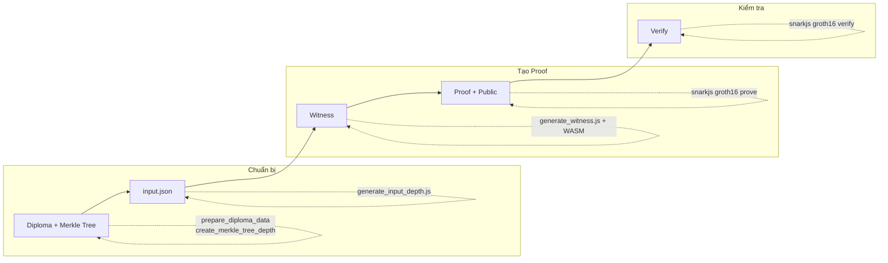
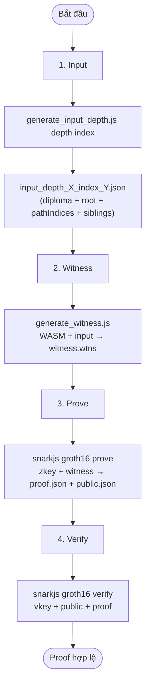
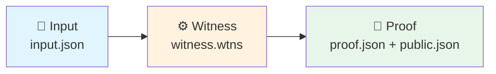

# Sơ đồ luồng tạo Proof chứng minh văn bằng

## ASCII (đơn giản, xem mọi nơi)

```
  ┌─────────────────┐     ┌─────────────────┐     ┌─────────────────┐
  │  1. INPUT       │     │  2. WITNESS     │     │  3. PROOF      │
  │                 │     │                 │     │                 │
  │  generate_      │ ──► │  generate_      │ ──► │  snarkjs       │
  │  input_depth.js │     │  witness.js     │     │  groth16 prove  │
  │                 │     │  + WASM         │     │                 │
  │  → input.json   │     │  → witness.wtns  │     │  → proof.json   │
  │                 │     │                 │     │  → public.json  │
  └─────────────────┘     └─────────────────┘     └────────┬────────┘
                                                           │
                                                           ▼
                                                  ┌─────────────────┐
                                                  │  4. VERIFY     │
                                                  │  snarkjs       │
                                                  │  groth16 verify│
                                                  └─────────────────┘
```

---

## Luồng tổng quan (Mermaid)



## Chi tiết từng bước



## Dạng đơn giản (3 bước chính)



## Công cụ tương ứng

| Bước   | Input        | Công cụ                    | Output              |
|--------|--------------|----------------------------|---------------------|
| 1      | depth, index | `generate_input_depth.js`  | `input_*.json`      |
| 2      | input + WASM | `generate_witness.js`     | `witness.wtns`      |
| 3      | zkey + witness | `snarkjs groth16 prove`  | `proof.json`, `public.json` |
| 4 (verify) | vkey + public + proof | `snarkjs groth16 verify` | OK / Fail |
